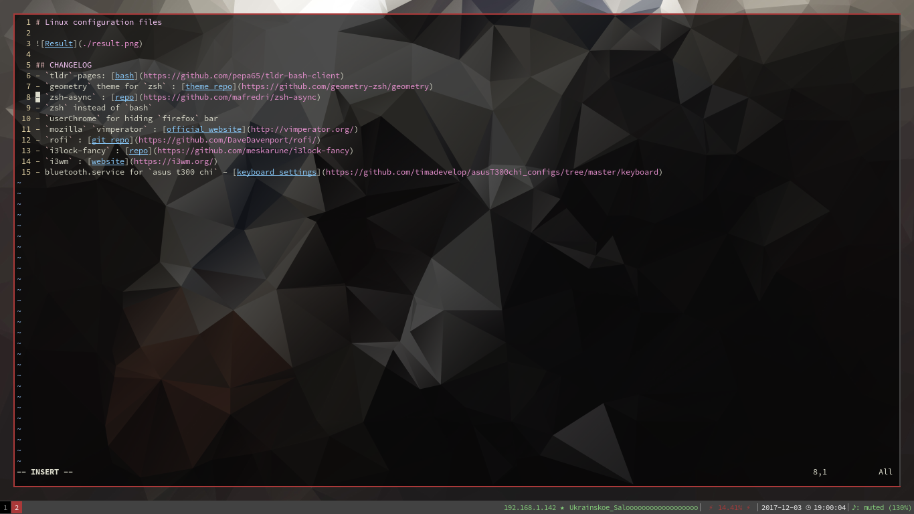

# Linux configuration files



## CHANGELOG
- `konsole` with `dark-pastels`
- `vim` - use [haskell-vim-now](https://github.com/begriffs/haskell-vim-now) + additional keymaps
- `tldr`-pages: [bash](https://github.com/pepa65/tldr-bash-client)
- `geometry` theme for `zsh` : [theme repo](https://github.com/geometry-zsh/geometry)
- `zsh-async` : [repo](https://github.com/mafredri/zsh-async)
- `zsh` instead of `bash`
- `userChrome` for hiding `firefox` bar
- `mozilla` `vimperator` : [official website](http://vimperator.org/)
- `rofi` : [git repo](https://github.com/DaveDavenport/rofi/)
- `i3lock-fancy` : [repo](https://github.com/meskarune/i3lock-fancy)
- `i3-gaps` / `i3wm` : [website](https://i3wm.org/)
- bluetooth.service for `asus t300 chi` - [keyboard settings](https://github.com/timadevelop/asusT300chi_configs/tree/master/keyboard)


## Dep
- `compton` for transparency
- `pip3 install --upgrade neovim` for deoplete
- `the_silver_searcher` for ag
- `i3-gaps`
-


## Nvidia optimus
- add bumblebee repo.
- `rpm -i` last nvidia cuda-downloads
- in bumblebee, bbswitch, cuda-{9-1:last-version}, ignore devidps
- add user to `video`, `bumblebee` groups
- block nouveau: 
```bash
echo "blacklist nouveau" >> /etc/modprobe.d/50-blacklist.conf
mkinitrd
```
- set bumblebee Driver=nvidia: `/etc/bumblebee/bumblebee.conf`
- enable and start `bumblebeed.service`

additional: install `primus` and see `primusrun-custom.sh`

nvidia settings: `optirun nvidia-settings -c :8`

### Check nvidia
`lsmod | grep bb` should show bbswitch

`lsmod | grep nouveau` should show nothing

`lsmod | grep nvidia` should show nothing directly after reboot

`cat /proc/acpi/bbswitch` should show OFF while no application is using the Nvidia GPU and ON otherwise

`optirun glspheres` should run sample
