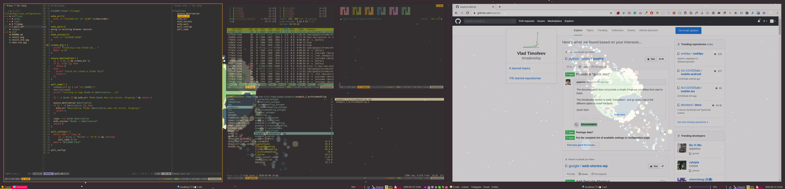

# Linux configuration files




## List
- `arch`
- `urxvt`
- `tmux`
- `neovim` + `gruvbox`
- `zsh`
- `geometry` theme for `zsh` : [theme repo](https://github.com/geometry-zsh/geometry)
- `zsh-async` : [repo](https://github.com/mafredri/zsh-async)
- `fuzzy finder`: [fzf](https://github.com/junegunn/fzf)
- `tldr`-pages: [bash](https://github.com/pepa65/tldr-bash-client)
- `rofi` : [git repo](https://github.com/DaveDavenport/rofi/)
- `i3lock-fancy` : [repo](https://github.com/meskarune/i3lock-fancy)
- `i3-gaps` / `i3wm` : [website](https://i3wm.org/)
- `polybar`
- `ranger` & `thunar` for file management
- `sxhkd` for wm independent keybindings
- `nitrogen` for wallpapers
- `zathura` for pdfs
- `yay` for AUR packages
- `flameshot` for screenshots
- See [packages.list](./packages.list) (`pacman -Qqe`)
- ~~bluetooth.service for `asus t300 chi` - [keyboard settings](https://github.com/timadevelop/asusT300chi_configs/tree/master/keyboard)~~
- ~~`konsole` with `dark-pastels`~~
- ~~`vim` - use [haskell-vim-now](https://github.com/begriffs/haskell-vim-now) + additional keymaps~~
- ~~`userChrome` for hidden `firefox` bar~~
- ~~`mozilla` `vimperator` : [official website](http://vimperator.org/)~~


## Deps
- `picom` for transparency
- `the_silver_searcher` for ag
- `noto-fonts-emoji`, `hack nerd font`, `siji`
- `light` or `xbacklight` for brightess controll 


## Nvidia optimus
- add bumblebee repo.
- `rpm -i` last nvidia cuda-downloads
- in bumblebee, bbswitch, cuda-{9-1:last-version}, ignore devidps
- add user to `video`, `bumblebee` groups
- block nouveau: 
```bash
echo "blacklist nouveau" >> /etc/modprobe.d/50-blacklist.conf
mkinitrd
```
- set bumblebee Driver=nvidia: `/etc/bumblebee/bumblebee.conf`
- enable and start `bumblebeed.service`

additional: install `primus` and see `primusrun-custom.sh`

nvidia settings: `optirun nvidia-settings -c :8`

#### Check nvidia
`lsmod | grep bb` should show bbswitch

`lsmod | grep nouveau` should show nothing

`lsmod | grep nvidia` should show nothing directly after reboot

`cat /proc/acpi/bbswitch` should show OFF while no application is using the Nvidia GPU and ON otherwise

`optirun glspheres` should run sample

